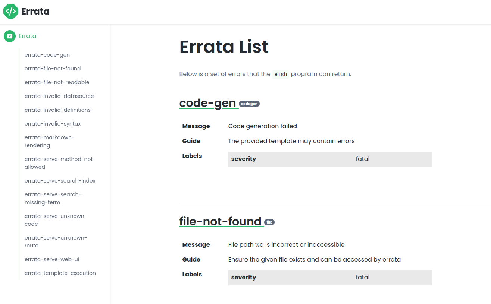

# `errata`

## WIP

... this is a work in progress, don't use it yet ...

---

`errata` is a tool with a simple but bold mission: to make software suck less.

Software mainly sucks because errors happen, and they're rarely handled with grace and empathy.

## Basic Concepts

`errata`'s philosophy is that errors should have **at least** a static error `code`, a human-readable `message`, and a `unique reference`.

- the `code` is searchable, and because it's static it becomes _more easily_ searchable.
- the `message` is displayed to the user alongside the code, to provide immediate context.
- the `unique reference` enables the receiver of the error message to track down the cause of the error.

`errata` provides a DSL for defining these errors in a central location in which engineers, technical writers, support consultants, and others can collaborate on explaining what went wrong.

### Definitions

`errata` uses the [HCL](https://github.com/hashicorp/hcl) structured configuration language, used primarily by [Terraform](https://www.terraform.io/). It's easy to read, simple to write, and frankly fuck YAML already.

```hcl
version = "0.1"

error "file-not-found" {
  message    = "File path %q is incorrect or inaccessible"
  categories = ["file"]
  guide      = "Ensure the given file exists and can be accessed"
  args       = [
    arg("path", "string")
  ]
  labels     = {
    severity = "fatal"
  }
}

...
```

The above example defines the `code` (**file-not-found**) and the `message`, along with some other useful metadata (more on this below).

This is rather useless on its own. `errata` provides a language-agnostic mechanism for generating code based on these definitions using the [Pongo2](https://github.com/flosch/pongo2) templating engine.

### Code Generation

**errata** comes with a CLI tool called **eish** (_**e**rrata **i**nteractive **sh**ell_,
[pronounced](http://ipa-reader.xyz/?text=e%C9%AA%CA%83) "eɪʃ") which generates code based on given `errata` definitions.

```bash
$ eish generate --source=errata.hcl --template=golang --package=errors
```

This will generate a single file with all error definitions. See the [sample errata](sample/errata.hcl) and [generated source](sample/errata/errors.go). In fact, there's a whole [sample application](sample/) which uses `errata` definitions (and rather recursively, the `errata` library also uses [`errata` definitions](errata.hcl)).

### Web UI

`eish` also provides a simple web UI, allowing your `errata` definitions to be viewed and searched.

```bash
$ eish serve --source=errata.hcl
```

The web UI by default runs on port `37707`.

